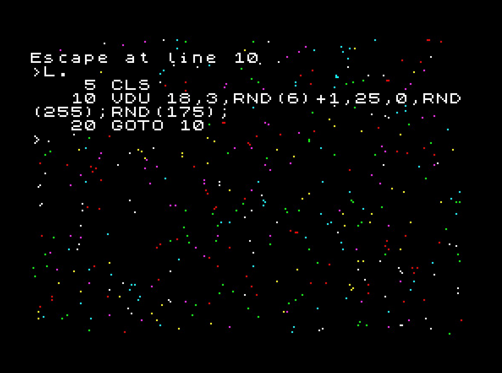

# next-bbc-basic
A port of BBC Basic for Z80 to the Spectrum Next

### What is BBC Basic for Z80?

The original version of BBC Basic was written by Sophie Wilson at Acorn in 1981 for the BBC Micro range of computers, and was designed to support the UK Computer Literacy Project. R.T.Russell ported the 6502 version to Z80, and this version has been implemented on a number of Z80 based machines. [You can find a full history of BBC Basic on his website](http://www.bbcbasic.co.uk/bbcbasic/history.html).

### Why am I doing this?

Whilst I love Sinclair BASIC, I feel that BBC Basic addresses many of its shortcomings, including the clunky editor, variable name length limitations for strings and arrays, and performance.

“Ah”, I hear you say. “I can load a BBC Micro Core in my Next to run BBC Basic”. Yes of course you can do that, and it is an excellent core. You will of course be restricted to BBC Model B hardware in doing so.

The advantage of running BBC Basic native on the Next is that it can potentially take advantage of the Next’s advanced graphics and sound capabilities; hardware sprites, Layer 2 graphics, multiple AY chips, and of course the legendary 28Mhz Turbo mode.

### The Challenges

The foundation of this port is R.T.Russell's original BBC Basic for Z80 code (for CP/M), with the CP/M specific code stripped out. This foundation code is just pure BASIC interpreter with no graphics, sound or file I/O support.

I will need to add all of that back in, in a manner that befits BBC Basic, whilst including all the features available to the Next in a language that was not designed to handle them, such as hardware sprites.

### Next Specific Modifications

I'm attempting to make this as close to Version 4 of the BBC Basic Standard, resident in the BBC Master series, to the degree that it should be able to load and run BBC Micro code. There are a handful of exceptions, noted in the [manual document](MANUAL.md).

### Assembling

The code is written to be assmbled by the SJASMPLUS assembler. Details of the toolchain I use [can be found here on my website](http://www.breakintoprogram.co.uk/computers/zx-spectrum-next/assembly-language/z80-development-toolchain).

Please note that you will need to set the conditional assembly flag BUILD_EMULATOR to 1 if you are assembling this for ZEsarUX. It uses out-of-date register numbers for the ULA hardware scrolling.

Every endeavour will be made to ensure the code is stable and will assemble, yet as this is a work-in-progress done in my spare time there will be instances where this is not the case. Please do not raise an issue in GIT, I'm more than likely aware of this!

### Releases

I'll dump significant updates as executable nex files in the [releases](releases) folder

### License

This code is distributable under the terms of a zlib license. Read the file [COPYING](COPYING) for more information.

The code, as originally written by R.T. Russell and [downloaded from David Given's GitHub page](https://github.com/davidgiven/cpmish/tree/master/third_party/bbcbasic), has been modified slightly, either for compatibility reasons when assembling using sjasmplus, or for development reasons for this release:

- General changes:
	- The top-of-file comments have been tweaked to match my style
	- GLOBAL and EXPORT directives have been removed and any global labels prefixed with @
	- Source in z80 now enclosed in MODULES to prevent label clash
	- A handful of '"' values have been converted to 34, and commented with ASCII '"'
	- A build.z80 file has been added; this includes all other files and is the file to build
	- All CPMish code has been removed as this version is not going to run on CP/M
- File patch.z80
	- The function PUT has been moved into it from exec.z80 
	- The function GET has been moved into it from eval.z80
- File exec.z80
	- The built-in assembler has bee modified to support Z80N instructions
	- The assembler opcodes table now uses a macro for sake of clarity

Other than that, the source code is equivalent to the code originally authored by R.T.Russell, downloaded on David Given's website: 

http://cowlark.com/2019-06-14-bbcbasic-opensource/index.html

The bulk of the Spectrum Next specific code I've written can be found in the z80 files prefixed with "next_". I've clearly commented any changes made to R.T.Russell's original source files in the source code.

Any additions or modifications I've made to port this to the Next have been released under the same licensing terms as the original code, and code that has been copied or inspired by other sources is clearly marked, with the appropriate accreditations.

Dean Belfield

Twitter: [@breakintoprogram](https://twitter.com/BreakIntoProg)
Blog: http://www.breakintoprogram.co.uk
